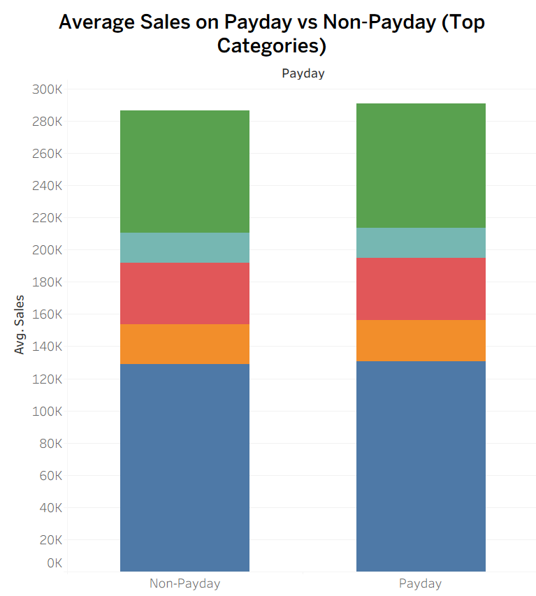
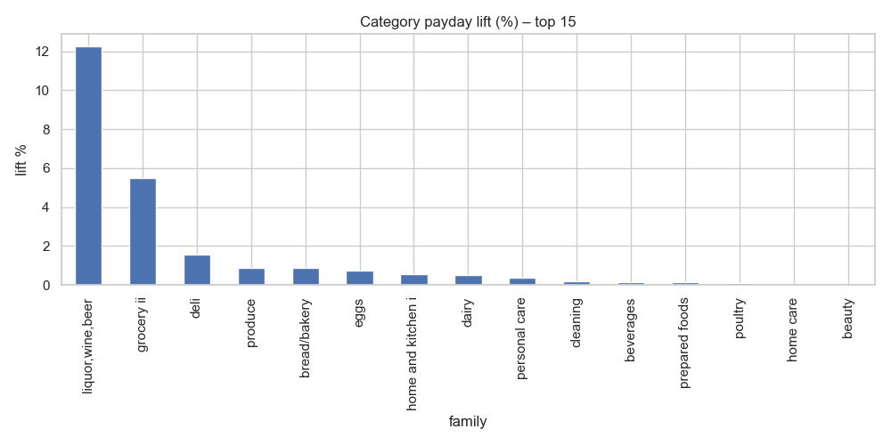
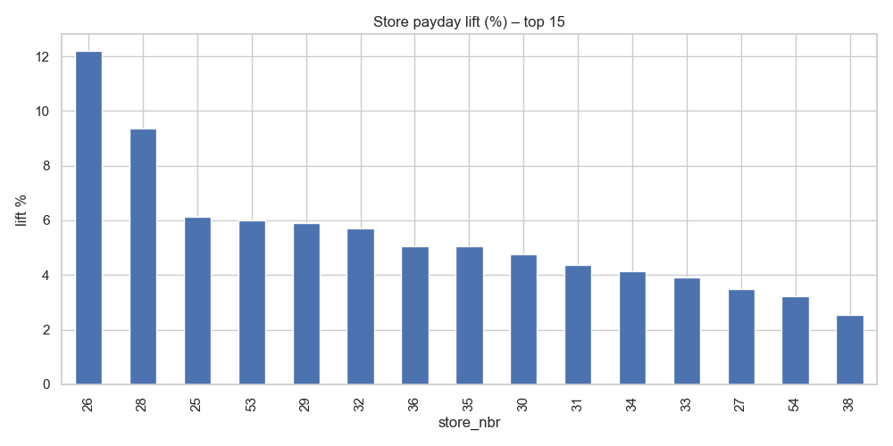

# Payday Surge Analysis – Corporación Favorita
*Causal analysis of Ecuadorian grocery demand surges around payday for data-driven inventory, promo, and staffing decisions.*

[](requirements.txt)
[](https://pandas.pydata.org/docs/)
[](https://www.statsmodels.org/)
[](https://github.com/google/CausalImpact)
[](https://matplotlib.org/stable/)
[](results/tableau/)


## Table of Contents
- [Business Question](#business-question)
- [Project Overview](#project-overview)
- [Data Sources](#data-sources)
- [Tools & Stack](#tools--stack)
- [Data Preparation](#data-preparation)
- [Key Findings & Insights](#key-findings-&-insights)
- [Recommendations](#recommendations)
- [Limitations](#limitations)
- [References & Repo Map](#references--repo-map)

---


## Business Question
Corporación Favorita’s operations and merchandising teams noticed spikes around Ecuadorian paydays (15th and end-of-month), when most workers get paid. 
Understanding whether these spikes are real and quantifiable is key for planning and resource allocation.  

Key questions are:
- **Do sales actually increase during these periods, and by how much?**  
- **Which categories and stores experience the largest lift?**  
- **How can these insights guide inventory planning, promotion timing, and staffing decisions?**


  
## Project Overview

This project analyzes **4.6 years of daily sales** across **54 stores** and **4036 product categorie**s to detect **reliable demand patterns.**

The objective is to apply **time-series modeling** and **causal inference** to quantify whether sales **significantly increase around payday periods (15th and end of month)**, and to measure the **magnitude of the lift** across **product categories** and **store clusters.** External factors like **holidays, oil prices,** and **store transactions** are incorporated to **capture demand fluctuations.**

The analysis provides evidence-based guidance on when to **increase inventory, adjust promotion schedules,** and **optimize staffing,** turning raw transaction data into actionable business strategy.


## Data Sources
Dataset used in this project: [Corporación Favorita Grocery Sales Forecasting](https://www.kaggle.com/competitions/favorita-grocery-sales-forecasting/data)

It spans from 2013-01-01 to 2017-08-15. 

External factors:

```train.csv``` : Target variable (unit_sales) at store–item–day level.

```transactions.csv``` : Number of daily transactions per store.

```oil.csv``` :  Daily oil price in Ecuador, capturing macroeconomic effects.

```holidays_events.csv``` :  National and regional holidays/events.

```stores.csv``` : Store metadata (city, state, type, cluster).

```items.csv``` : Item metadata (family/category, class, perishability).

```test.csv and sample_submission.csv``` : Not used in this analysis.


The original Corporación Favorita dataset (train/test CSVs) is **not included** in this repo due to size constraints (hundreds of MBs, exceeds GitHub’s limits).  

- Omitted: `train.csv`, `test.csv`  
- Included: processed parquet outputs (`data/processed/`), sufficient to reproduce analysis  

To fully rerun from raw:  
1. Download from Kaggle: [Favorita Grocery Sales Forecasting](https://www.kaggle.com/competitions/favorita-grocery-sales-forecasting).  
2. Place into `data/raw/`.  
3. Re-run `01_Data_preparation.ipynb`.  


> [!NOTE]
> All files are provided in ``` .7z ``` compressed format on Kaggle. The uncompressed, unzipped ``` .csv ``` files are used throughout this project.


## Tools & Stack

- **Environment:** Python 3.11, Conda/venv, VS Code, Jupyter, Git  
- **Data Handling & Storage:** Pandas, NumPy, PyArrow, Parquet, DuckDB (SQL)  
- **Modeling & Forecasting:** Statsmodels (SARIMAX), CausalImpact, scikit-learn, pmdarima  
- **Visualization & Reporting:** Matplotlib, Seaborn, Tableau  
- **Orchestration & Pipelines (light):** Apache Airflow (stub DAGs), dbt (DuckDB scaffold)  
- **Containerization (light):** Docker (stub Dockerfile for reproducibility)  
- **Warehouse (light):** Snowflake / BigQuery (config scaffolds, not integrated)


## Data Preparation
Raw ``` train.csv ``` shows daily sales per store and product family but **does not include rows for items that had zero** ```unit_sales```. Meaning that if an an ```item-nbr``` was sold 0 units, the row would not exist, creating sparsity. This might lead to overrepresented active sales periods.
To deal with this issue, I've decided to keep the dataset(sparse format) as this gives faster experimentation (avoid dealing with billions of rows).

The raw `train.csv` (~670MB) and `test.csv` (~120MB) exceed GitHub’s file size limits therefore they are **not included in this repository**.  


## Key Findings and Insights
> Full exploratory notebooks are available under [`notebooks/01_Data_preparation.ipynb`](notebooks/01_Data_preparation.ipynb).  
> Below are the main insights extracted from that exploration.

📊 [Explore Interactive Dashboard](https://public.tableau.com/shared/JD8ZSGG8R?:display_count=n&:origin=viz_share_link)

  

- Payday periods lift average daily sales by **+1.4%**.  
- Strongest uplift: *Beverages* and *Bakery*.  
- High-volume stores show clearer payday spikes.

  
  
  


## Recommendations
- **High Impact:** Allocate extra inventory to top surge categories; ensure replenishment on payday and the following day.
- **Medium Impact:** Add short shifts in the top-lift stores during payday periods.
- **Low Impact:** Run targeted promos on discretionary categories that show strong lift.


## Limitations
- Dataset scope: Ecuador, 2013–2017. External shocks not fully modeled.
- No forecasting baseline included (e.g., seasonal-naive, SARIMAX). Results show correlations,
  not causal effects beyond normal weekly seasonality.
- Next:
  - Automate refresh with **Airflow + Snowflake**.
  - Containerize pipeline with **Docker** to ensure reproducibility and easy deployment across environments. 
  - Refit with newer data and validate seasonality/holiday controls.

## References & Repo Map
**References:**
- [Corporación Favorita Grocery Sales Forecasting Dataset](https://www.kaggle.com/competitions/favorita-grocery-sales-forecasting)  
- [Causal Impact Documentation](https://google.github.io/CausalImpact/)  
- [Apache Airflow Documentation](https://airflow.apache.org/docs/)  
- [1st Place LGB Model(public:0.506, private:0.511)](https://www.kaggle.com/code/shixw125/1st-place-lgb-model-public-0-506-private-0-511)
- [web-traffic-forecasting](https://github.com/sjvasquez/web-traffic-forecasting/blob/master/cnn.py)

  
**Repo Map:**
```markdown
├── configs/                           # Config files YAML 
├── data/                              # Raw and processed datasets
├── notebooks/                         # Jupyter notebooks 
├── results/                           # Outputs
├── src/                               # Source code
├── tests/                             # Unit tests for reproducibility and validation
├── .gitignore                         # Ignore file
├── LICENSE                            # License
├── README.md                          # Documentation
├── environment.yml                    # Conda environment specification
└── requirements.txt                   # Python dependencies
```

---

<details>
<summary><h2> Project Setup (click to expand)</h2></summary>

- [Installation](#installation)
- [Usage](#usage)
- [Contributing](#contributing)
- [License](#license)

</details>


---

 ## Installation
Clone the repository and install dependencies:

```bash
git clone https://github.com/Datayx/Payday-surge-favorita.git
cd payday-surge-favorita
python -m venv .venv
source .venv/bin/activate      
pip install -r requirements.txt

```


 ## Usage
Run the full pipeline:

```bash
python scripts/run_pipeline.py
```

 ## Contributing
This project is created to showcase data engineering and data science workflows.  
Issues and pull requests are not actively monitored.  
Feel free to fork the repository for your own learning or adaptation.


 ## License
This project is licensed under the [MIT License](./LICENSE)..

